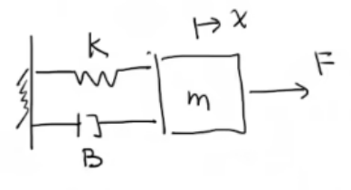
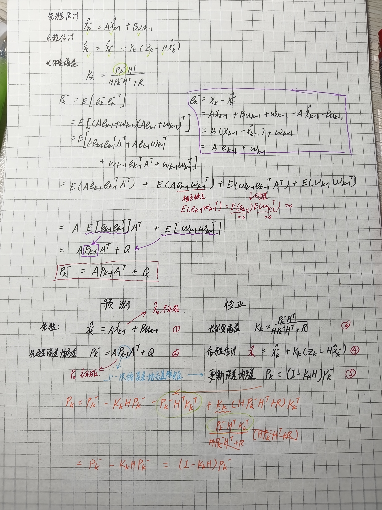

# Kalman Filter Note
## Math Fundamental
### Part1.Data Fusion

example:

$z_1 = 30g$ $~~~~~~~~~~~~~$ $\sigma_1 = 2g~~~(standard~deviatim)$

$z_2 = 32g$ $~~~~~~~~~~~~~$ $\sigma_2 = 4g~~~$

服从 $ Natural~Distribution~ $ or $~Gaussion~Distribution$

估计真实值 $ \hat{z} = z_1+k(z_2-z_1)~~~~~k$ 是 $Kalman~Gain$

$~~~~~~~~~~~~~~~~~~~~~~~~~~~~~~~~~~~~~~~~~~~~~~~~~~~~~~~k\in[0,1]$

$~~~~~~~~~~~~~~~~~~~~~~~~~~~~~~~~~~~~~~~~~~~~~~~~~~~~~当k=0 : \hat{z} = z_1$

$~~~~~~~~~~~~~~~~~~~~~~~~~~~~~~~~~~~~~~~~~~~~~~~~~~~~~当k=1:\hat{z} = z_2$

求解合适的 $k$ 使得 $\sigma_{\hat{z}}$ 最小，也就是方差 $var(\hat{z})$ 最小

$ \sigma^2_{\hat{z}} = var(~z_1+k(z_2-z_1))~=var~((1-k)z_1+kz_2)~~~~$ $z_1$ 和 $z_2$ 相互独立

$~~~~~=var((1-k)z_1)+var(kz_2)=(1-k)^2var(z_1)+k^2var(z_2)$

$~~~~~=(1-k)^2\sigma_1^2+k^2\sigma_2^2$

令$~\sigma^2_{\hat{z}}~$ 对 $ k $ 的导数 $d\sigma_{\hat{z}}^2/dk = -2(1-k)\sigma_1^2+2k\sigma_2^2 = 0$

得到 $k =  \sigma_1^2/(\sigma_1^2+\sigma_2^2)$

带入所给数值可得 $k = 2^2/(2^2+4^2) = 0.2$ 而$\hat{z} = z_1+k(z_2-z_1) = 30.4$

$~~~~~~~~~~~~~~~~~~~~~~~~~~\sigma^2_{\hat{z}} = (1-0.2)^22^2+0.2^24^2 = 3.2$

$~~~~~~~~~~~~~~~~~~~~~~~~~~\sigma_{\hat{z}} = \sqrt{3.2} = 1.79$

### Part2.Convariance Matrix

协方差矩阵 -> 方差和协方差在一个矩阵中表现出来 -> 变量间的联动关系

example:

表格

| 姓名  | 身高 (x)| 体重 (y) | 年龄 (z) |
| ---- | ---- | ---- | ---- |
| 瓦尔迪 | 179 | 74   | 33   |
|奥巴梅杨|187   | 80   | 28  |
|萨拉赫| 175    | 71   | 28  |
|平均|180.3|75|30.7|

方差：

$ \sigma_x^2 = \frac{1}{3}((179-180.3)^2+(187-180.3)^2+(175-180.3)^2)=24.89$

$ \sigma_y^2 = 14 $

$ \sigma_z^2 = 4.22 $

协方差：

$ \sigma_x\sigma_y = \frac{1}{3}((179-180.3)(74-75)+(187-180.3)(80-75)+(175-180.3)(71-75)) = 18.7 = \sigma_y\sigma_x$

可知 $ \sigma_x\sigma_y > 0 $ 时，二者呈现正相关; $ \sigma_x\sigma_y < 0$ 时，二者呈现负相关

$ \sigma_x\sigma_z = \sigma_z\sigma_x = 4.4$

$ \sigma_z\sigma_y = \sigma_y\sigma_z = 3.3$

协方差矩阵： $P = \left[ \begin{matrix} 
\sigma_x^2       & \sigma_x\sigma_y & \sigma_x\sigma_z\\
\sigma_y\sigma_x & \sigma_y^2       & \sigma_y\sigma_z\\
\sigma_z\sigma_x & \sigma_z\sigma_y & \sigma_z^2      \\
\end{matrix}\right]
=\left[\begin{matrix}
24.89  & 18.7 & 4.4  \\
18.7   & 14   & 3.3  \\
4.4    & 3.3  & 4.22  \\
\end{matrix}\right] $

过渡矩阵:
$a = \left[\begin{matrix}
x_1  & y_1 & z_1 \\
x_2  & y_2 & z_2  \\
x_3  & y_3 & z_3  \\
\end{matrix}\right] - \frac{1}{3}\left[\begin{matrix}
1 & 1 & 1  \\
1 & 1 & 1  \\
1 & 1 & 1  \\
\end{matrix}\right]
\left[\begin{matrix}
x_1  & y_1 & z_1 \\
x_2  & y_2 & z_2  \\
x_3  & y_3 & z_3  \\
\end{matrix}\right]$

$P = \frac{1}{3}a^Ta$

### Part3.State Space Representation

状态空间表达

example:

弹簧震动阻尼系统

其中 $m$是物体质量; $F$是力; $x$是正向位移; $k$是劲度(胡克)系数; $B$是阻尼系数

动态方程表达式: $ m\ddot{x}~+~B\dot{x}~+~kx=F $ $~~~(1)$ 

将$F$定义成$u = Input$(系统的输入)

可以定义:$~~~~~x_1 = x $

$ ~~~~~~~~~~~~~~~~~~~x_2 = \dot{x} $

则有:$~~~~~~~~~~~~\dot{x_1} = x_2$

$~~~~~~~~~~~~~~~~~~~~\dot{x_2} = \ddot{x}$

$(1)$ 式可化为: $m\ddot{x}=u-B\dot{x}~-~kx$

则 $\dot{x_2} = \ddot{x} = \frac{1}{m}u-\frac{B}{m}\dot{x}-\frac{k}{m}x$

$~~~~~~~~~~~~~~~~~=\frac{1}{m}u-\frac{B}{m}x_2-\frac{k}{m}x_1$

定义两个测量量(Measurement):

$z_1 = x = x_1$ 表示位置的测量量

$z_2 = \dot{x} = x_2$ 表示速度的测量量

使用矩阵可以表达(连续的形式下):

$\left[\begin{matrix}
\dot{x_1} \\
\dot{x_2} \\
\end{matrix}\right] = 
\left[\begin{matrix}
0 & 1  \\
-\frac{k}{m} & -\frac{B}{m}  \\
\end{matrix}\right]
\left[\begin{matrix}
x_1 \\
x_2 \\
\end{matrix}\right]+
\left[\begin{matrix}
0\\
\frac{1}{m}\\
\end{matrix}\right]u$ $~~~(2)$

$\left[\begin{matrix}
z_1 \\
z_2 \\
\end{matrix}\right] = 
\left[\begin{matrix}
1 & 0  \\
0 & 1  \\
\end{matrix}\right]
\left[\begin{matrix}
x_1 \\
x_2 \\
\end{matrix}\right]$ $~~~(3)$

$(2),(3)$可以化为:

$\dot{X}(t)=AX(t)+Bu(t)$

$Z(t)=HX(t)$

若使用离散形式:

$\dot{X_k}=AX_{k-1}+Bu_{k-1}$

$Z_k = HX_k$

由于测量,计算存在不确定性，上述离散形式的方程可以化为:

$\dot{X_k}=AX_{k-1}+Bu_{k-1}+\omega_{k-1}$

$Z_k = HX_k+v_k$

上述$\omega_{k-1}$为 过程噪音 $Process~Noice$

$v_k$为 测量噪音 $Measurement~Noice$

## Derivation

### Part1.Kalman Gain

卡尔曼增益的数学推导过程:

### Part2.Priori/Posteriori Error Covariance Matrix

误差协方差矩阵

### Part3.Summary

step1.先验估计 $~~~~~~~~~~~\hat{x}^{-}_k=A\hat{x}^{-}_{k-1}+Bu_{k-1}$

step2.先验误差协方差 $P^{-}_k=AP_{k-1}A^T+Q$

step3.卡尔曼增益 $~~~~~~~K_k = \frac{P^{-}_kH^T}{HP^{-}_kH^T+R}$

step4.后验估计 $~~~~~~~~~~\hat{x}_k=\hat{x}^{-}_k+K_k(Z_k-H\hat{x}^{-}_k)$

step5.更新误差协方差 $P_k=(I-K_kH)P^{-}_k$

